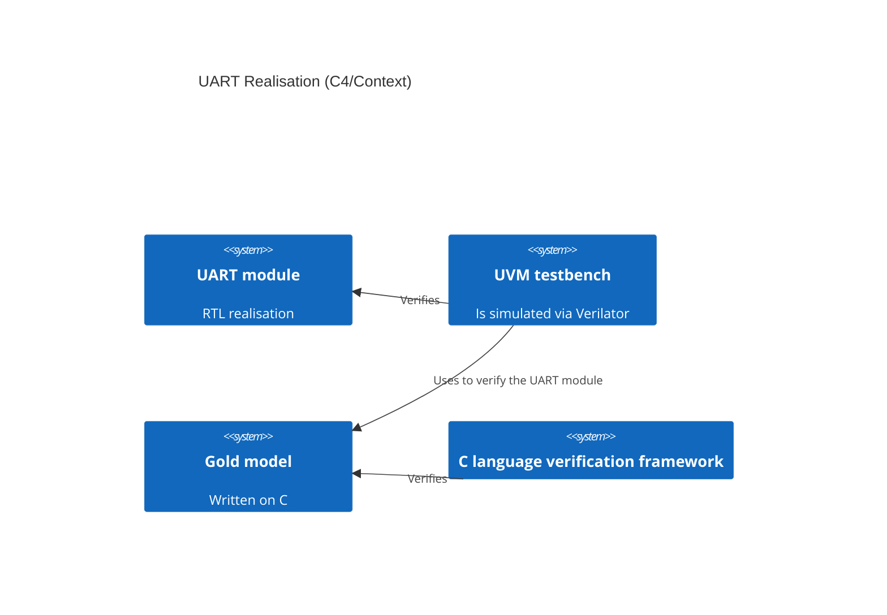

# Concept of the project

## Vision

We think, that the best way to please our hunger of knowledge is practice. It should be sophisticated enough to we are able to grow up and be simple enough to we are able to complete it. In align with this requisites, we've selected an UART module as the main artifact of the our project. We've decided to learn Universal Verification Methodology \(UVM\), so the UART module has to be verified with UVM. To do such a verification we need the gold model, which it use to write on programming languages. According to our preferences, we've agreed with each other to use the C programming language as a tool to build the model. As it's named *gold* model, we have to prove this *goldness*. To reach this aim we will verify the model too. The instrument we will use is the Frama-C Framework (because of the desire to learn it).

## Goal

The goal of the project is the verified RTL realisation of UART.

## Tasks

- Design and develop the UART module
- Design and develop the gold model of the module
- Verify the gold model using formal verification methods
- Verify the module using the gold model

## Architecture

We'll try to show the idea of the project using the C4 notation:

## Resources

### The list of tools
- SystemVerilog
- UVM
- Verilator
- C
- Frama-C
- Unity \(by Throw the Switch\)
- Linux perf utility
